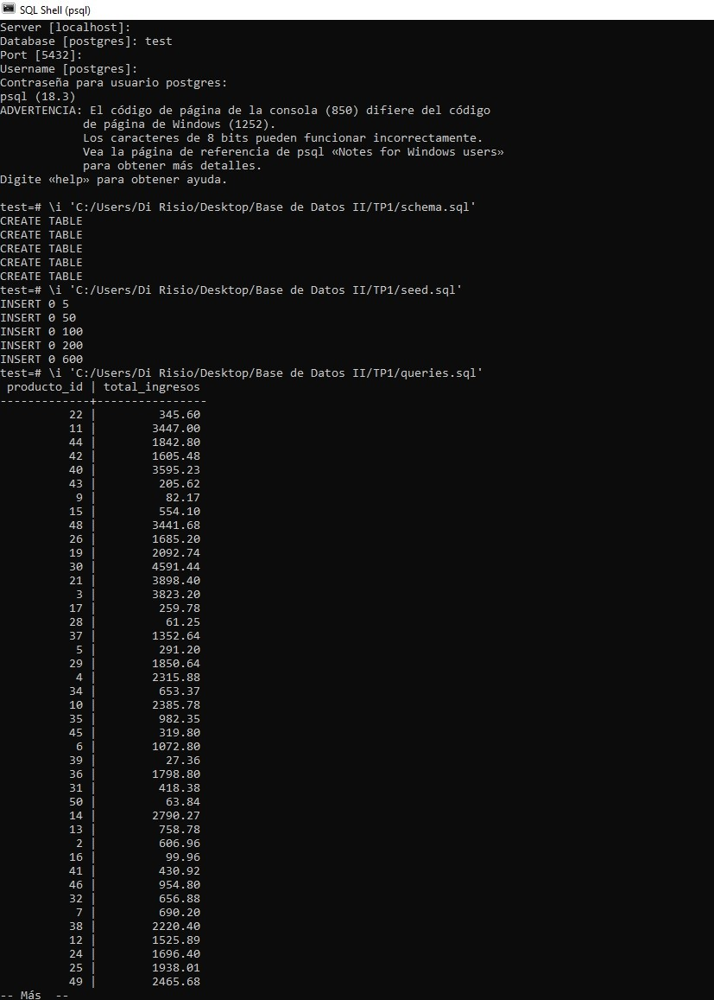

# TP1: Sistema de Gestión de Pedidos, Stock y Clientes

## Desarrollador 👨‍💻:

- **Desarrollador:** Matías Di Risio 👍
- **GitHub:** [DiriARG](https://github.com/DiriARG)

## Docente 👨‍🏫:

- **Profesor:** Eduardo Leiva

## Tabla de contenidos 📚:

- [Instrucciones de ejecución](#instrucciones-de-ejecución-)
- [Decisiones de diseño y normalización](#decisiones-de-diseño-y-normalización-️)
- [Generación de datos](#generación-de-datos-)

## Instrucciones de ejecución 🚀:

> [!IMPORTANT]
> Se recomienda crear una base de datos nueva antes de ejecutar los scripts. Esto evitará conflictos con tablas existentes y mantendrá tu entorno organizado.

Para recrear la base de datos completa en un entorno **PostgreSQL**, es indispensable ejecutar los scripts en el **siguiente orden**:

1. **schema.sql**: Crea la estructura de tablas, restricciones de integridad y relaciones.

2. **seed.sql**: Genera los datos de prueba (50 productos, 100 clientes y 200 pedidos con sus detalles).

3. **queries.sql**: Contiene las 13 consultas analíticas solicitadas.

A continuación, elegí el método que prefieras para la ejecución:

### Opción 1: Interfaz gráfica (pgAdmin 4)

Es la opción recomendada si preferís usar herramientas visuales:

1. Abrí el programa `pgAdmin 4`.
1. Hacé clic derecho sobre tu base de datos y seleccioná **Herramienta de consulta** (Query Tool) o presioná `Alt + Shift + Q`.
1. Abrí el archivo .sql haciendo click en el ícono de carpeta (Open File) o con `Ctrl + O`.
1. Ejecutá el script con el botón ▶️ (Execute Script) o la tecla `F5`.
1. Repetí el proceso respetando el orden mencionado arriba.

### Opción 2: Consola PSQL integrada en pgAdmin

Si ya estás dentro de pgAdmin pero preferís la velocidad de la consola:

1. Hacé clic derecho sobre tu base de datos y seleccioná "Herramienta PSQL".
2. Se abrirá una terminal ya conectada. Ejecutá los siguientes comandos (ajustando la ruta según la ubicación de los archivos en tu equipo):

```bash
\i 'C:/ruta/a/tu/schema.sql'
\i 'C:/ruta/a/tu/seed.sql'
\i 'C:/ruta/a/tu/queries.sql'
```

### Opción 3: Línea de comandos (SQL Shell / psql)

1. Abrí el programa `SQL Shell (psql)`.
2. El programa te pedirá los datos de conexión. Si configuraste todo por defecto al instalar PostgreSQL, podés simplemente presionar `Enter` en casi todos, excepto en la base de datos y la contraseña::

- Server [localhost]: Enter.
- Database [postgres]: Escribí el nombre de la base de datos a la que quieras conectarte y Enter.
- Port [5432]: Enter.
- Username [postgres]: Enter.
- Contraseña: Escribí tu clave y presioná Enter.
  - Nota: Por seguridad, psql no mostrará caracteres ni asteriscos mientras escribís. Solo tipea y dale a Enter.

3. Una vez conectado, verás el prompt indicando que estás listo para operar:

```bash
nombre_base_datos=#.
```

4. Ejecutá los archivos usando el comando `\i` seguido de la ruta absoluta (ajustá la ruta según la ubicación de los archivos en tu sistema):

```bash
\i 'C:/ruta/a/tu/schema.sql'
\i 'C:/ruta/a/tu/seed.sql'
\i 'C:/ruta/a/tu/queries.sql'
```

Imagen de ejemplo:  


## Decisiones de diseño y normalización 🏗️:

### Normalización

El modelo se diseñó siguiendo los principios de la **tercera forma normal (3NF)** para garantizar la integridad de los datos y eliminar redundancias:

- **1FN (Atomicidad)**: Todos los atributos contienen valores atómicos (nombres, correos, precios y fechas), sin listas, ni grupos repetitivos.
- **2FN (Dependencia funcional)**: Se eliminaron las dependencias parciales mediante el uso de claves primarias simples (`producto_id`, `categoria_id` y `cliente_id`) y una clave primaria compuesta en **detalle_pedido** (`pedido_id`, `producto_id`). Esto garantiza que todos los atributos no clave dependan de la clave primaria completa.
- **3FN (Dependencia transitiva)**: Se separaron las categorías en una tabla independiente, evitando que los atributos descriptivos de la categoría (como `nombre`) dependan transitivamente del ID del producto (`producto_id`). Así, los atributos no clave dependen directamente de su clave primaria.

### Integridad referencial y reglas de negocio

Se implementaron acciones de `FOREIGN KEY` y restricciones de dominio que reflejan el comportamiento de un sistema de gestión real:

- **ON DELETE RESTRICT** (en `clientes` y `productos`): Protege la integridad del historial contable, impidiendo borrar registros que ya tengan transacciones vinculadas.
- **ON DELETE CASCADE** (en `detalle_pedido`): Si un pedido se elimina, automáticamente se eliminan todos sus registros asociados para evitar "datos huérfanos" en el sistema.
- **ON DELETE SET NULL** (en `productos`): Si una categoría es dada de baja, los registros en la tabla de productos se mantienen activos pero su referencia pasa a ser nula ("sin clasificar"), preservando el registro del stock físico.
- **Restricciones de dominio** (`CHECK`): Se aplicaron validaciones a nivel de motor para garantizar la calidad de la información:
  - **Lógica de inventario**: Se aseguró que el precio sea > 0 y el stock sea ≥ 0 para prevenir estados lógicamente imposibles.
  - **Validación de formato**: Se incorporó una restricción de dominio **básica** en el campo `email` para asegurar la presencia del carácter `@` en una posición válida, actuando como primera línea de defensa sin recurrir a validaciones externas.

#### Notas técnicas adicionales sobre schema.sql:

- **Flexibilidad y tipos de datos string**: Se optó por el tipo `TEXT` para todas las cadenas de caracteres (`nombre`, `email`, `ciudad`), siguiendo la premisa **"Default → TEXT"**. Al no existir en la consigna reglas de negocio explícitas que limiten la longitud de los campos, se evitaron restricciones arbitrarias como `VARCHAR(255)`, aprovechando que en PostgreSQL no hay penalizaciones de rendimiento.
- **Integridad de datos monetarios**: Se utiliza `NUMERIC(10,2)` en todas las columnas de montos. A diferencia de los tipos de punto flotante (como `FLOAT` o `REAL`), este tipo de dato evita errores de redondeo decimal, algo indispensable para la exactitud contable.
- **Precio histórico e integridad contable**: Se almacena el `precio_unitario` directamente en la tabla **detalle_pedido**. Aunque el precio ya existe en la tabla productos, esta **desnormalización deliberada** garantiza que si un producto cambia de precio en el futuro, las ventas pasadas mantengan su valor original.

## Generación de datos 📊:

Para poblar la base de datos con información coherente y masiva, se utilizaron funciones nativas de PostgreSQL en el archivo **seed.sql**:

- **generate_series**: Utilizada para la creación masiva de registros sintéticos (datos artificiales que imitan información real, sin provenir de usuarios ni eventos reales), permitiendo escalar el volumen de datos de forma automática.
- **floor(random() \* N + 1)**: Aplicada para generar valores enteros aleatorios en el rango `[1, N]`, a partir de números decimales generados por `random()`, manteniendo una distribución uniforme.
- **Casteo de tipos (::int / ::numeric)**: Conversiones explícitas para ajustar el resultado de funciones como random() al tipo de dato definido en el **schema.sql**, garantizando compatibilidad con la estructura de la base de datos.
- **CROSS JOIN LATERAL**: Utilizado para el detalle de los pedidos. Esto permite que cada pedido contenga múltiples productos distintos (3 por pedido), simulando un comportamiento de compra real y permitiendo que las consultas de agregación (`SUM`, `AVG`) tengan sentido estadístico.
